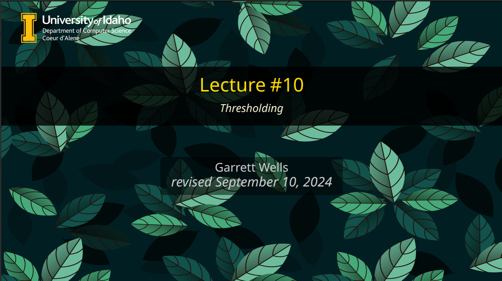

# University of Idaho Themed Beamer Slides

The files in this directory define a beamer theme using University of Idaho colors, logos, etc. Users are encouraged to redefine options in `.sty` files to their preferences. Documentation on customization is primarily pulled from two resources:

1. Stack Exchange: [Tikz PGF Custom Beamer Template](https://tex.stackexchange.com/questions/146529/design-a-custom-beamer-theme-from-scratch)

    - this thread has several examples of copy and paste beamer themes which were used and modified to produce the desired theme
  
2. [Beamer Manual](https://www.beamer.plus/home.html) which documents the customization provided through the four types of `sty` files and the theme customization system as a whole.

>[!CAUTION]
> This theme uses logos from the University of Idaho. Thus users must adhere to conditions of use according to the University policies. See usage conditions [at U of I's logo guide.](https://www.uidaho.edu/brand/brand-style-guide#logo)

## Usage
>[!TIP] 
> I have written a Lua script to simplify LaTeX project creation and management. For Linux(Ubuntu and Pop!OS) users I highly recommend taking advantage of its features to simplify working with LaTeX/Beamer. Find it [here](https://github.com/grwells/latex-toolkit.git)

1. Import into latex project. Place contents of directory at same level as your main LaTeX document file.

    `ltk -n <project_name> --add-theme <path_to_this_directory>`

2. Edit the theme as desired.

    - Change background: edit `beamerthemeuofi.sty` title background image to point to your desired background.
    - Change logo: edit `beamerthemeuofi.sty` title logo image to point to desired logo. Two logos are included by default, U of I logo with white text and U of I logo with black text.

3. Compile to test.

    `ltk -egv`

    - Sets shell escape, generates pdf, opens output PDF in default system viewer.
